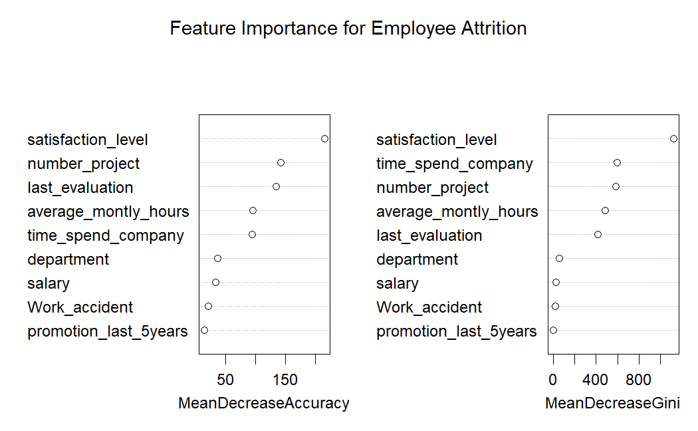

HR Attrition Analysis Using Random Forest
================
AhmedLubis
2026-07-04

# ==============================================================================

# HUMAN RESOURCES ATTRITION ANALYSIS USING RANDOM FOREST

# ==============================================================================

# Step 1: Load Required Libraries

``` r
library(tidyverse)
```

    ## Warning: package 'tidyverse' was built under R version 4.5.3

    ## Warning: package 'ggplot2' was built under R version 4.5.3

    ## Warning: package 'purrr' was built under R version 4.5.3

    ## Warning: package 'dplyr' was built under R version 4.5.3

    ## ── Attaching core tidyverse packages ──────────────────────── tidyverse 2.0.0 ──
    ## ✔ dplyr     1.2.1     ✔ readr     2.1.6
    ## ✔ forcats   1.0.1     ✔ stringr   1.6.0
    ## ✔ ggplot2   4.0.3     ✔ tibble    3.3.1
    ## ✔ lubridate 1.9.5     ✔ tidyr     1.3.2
    ## ✔ purrr     1.2.2     
    ## ── Conflicts ────────────────────────────────────────── tidyverse_conflicts() ──
    ## ✖ dplyr::filter() masks stats::filter()
    ## ✖ dplyr::lag()    masks stats::lag()
    ## ℹ Use the conflicted package (<http://conflicted.r-lib.org/>) to force all conflicts to become errors

``` r
library(randomForest)
```

    ## Warning: package 'randomForest' was built under R version 4.5.3

    ## randomForest 4.7-1.2
    ## Type rfNews() to see new features/changes/bug fixes.
    ## 
    ## Attaching package: 'randomForest'
    ## 
    ## The following object is masked from 'package:dplyr':
    ## 
    ##     combine
    ## 
    ## The following object is masked from 'package:ggplot2':
    ## 
    ##     margin

``` r
library(caret)
```

    ## Warning: package 'caret' was built under R version 4.5.3

    ## Loading required package: lattice
    ## 
    ## Attaching package: 'caret'
    ## 
    ## The following object is masked from 'package:purrr':
    ## 
    ##     lift

# ——————————————————————————

# Step 2: Load and Clean the Dataset

# ——————————————————————————

``` r
# Read the file with proper delimiter (;) and handle empty text inputs as NA
hr_raw <- read_delim("hr_data.csv", delim = ";", na = c("", "NA"))
```

    ## Rows: 14999 Columns: 10
    ## ── Column specification ────────────────────────────────────────────────────────
    ## Delimiter: ";"
    ## chr (2): sales, salary
    ## dbl (8): satisfaction_level, last_evaluation, number_project, average_montly...
    ## 
    ## ℹ Use `spec()` to retrieve the full column specification for this data.
    ## ℹ Specify the column types or set `show_col_types = FALSE` to quiet this message.

``` r
# Clean columns and handle categorical data types
hr_cleaned <- hr_raw %>% 
  rename(department = sales) %>% 
  drop_na() %>% # Drop rows with missing values to ensure model stability
  mutate(
    # Target variable 'left' must be a factor for classification
    left = factor(left, levels = c(0, 1), labels = c("Stayed", "Left")),
    
    # Format all categorical variables as factors
    salary = factor(salary, levels = c("low", "medium", "high")),
    department = as.factor(department),
    Work_accident = as.factor(Work_accident),
    promotion_last_5years = as.factor(promotion_last_5years)
  )

# Verify structural transformations
glimpse(hr_cleaned)
```

    ## Rows: 14,430
    ## Columns: 10
    ## $ satisfaction_level    <dbl> 0.80, 0.72, 0.37, 0.41, 0.10, 0.92, 0.89, 0.42, …
    ## $ last_evaluation       <dbl> 0.86, 0.87, 0.52, 0.50, 0.77, 0.85, 1.00, 0.53, …
    ## $ number_project        <dbl> 5, 5, 2, 2, 6, 5, 5, 2, 2, 6, 4, 2, 2, 2, 2, 4, …
    ## $ average_montly_hours  <dbl> 262, 223, 159, 153, 247, 259, 224, 142, 135, 305…
    ## $ time_spend_company    <dbl> 6, 5, 3, 3, 4, 5, 5, 3, 3, 4, 5, 3, 3, 3, 3, 6, …
    ## $ Work_accident         <fct> 0, 0, 0, 0, 0, 0, 0, 0, 0, 0, 0, 0, 0, 0, 0, 0, …
    ## $ left                  <fct> Left, Left, Left, Left, Left, Left, Left, Left, …
    ## $ promotion_last_5years <fct> 0, 0, 0, 0, 0, 0, 0, 0, 0, 0, 0, 0, 0, 0, 0, 0, …
    ## $ department            <fct> sales, sales, sales, sales, sales, sales, sales,…
    ## $ salary                <fct> medium, low, low, low, low, low, low, low, low, …

# ——————————————————————————

# Step 3: Split Data into Training and Testing Sets

# ——————————————————————————

``` r
set.seed(123)

# Stratified split: 70% for training, 30% for testing
train_index <- createDataPartition(hr_cleaned$left, p = 0.70, list = FALSE)
train_set   <- hr_cleaned[train_index, ]
test_set    <- hr_cleaned[-train_index, ]

# Print sizes to confirm the split balance
cat("Training Set size:", nrow(train_set), "\n")
```

    ## Training Set size: 10102

``` r
cat("Testing Set size:", nrow(test_set), "\n")
```

    ## Testing Set size: 4328

# ——————————————————————————

# Step 4: Train the Random Forest Classifier

# ——————————————————————————

``` r
# Train an ensemble of 500 decision trees
rf_model <- randomForest(
  left ~ ., 
  data = train_set, 
  ntree = 500, 
  importance = TRUE
)

# Print overall model summary and Out-Of-Bag (OOB) error rate
print(rf_model)
```

    ## 
    ## Call:
    ##  randomForest(formula = left ~ ., data = train_set, ntree = 500,      importance = TRUE) 
    ##                Type of random forest: classification
    ##                      Number of trees: 500
    ## No. of variables tried at each split: 3
    ## 
    ##         OOB estimate of  error rate: 1%
    ## Confusion matrix:
    ##        Stayed Left class.error
    ## Stayed   7987   13  0.00162500
    ## Left       88 2014  0.04186489

# ——————————————————————————

# Step 5: Evaluate Model Performance (Confusion Matrix)

# ——————————————————————————

``` r
# Predict the status of employees in the unseen test set
test_predictions <- predict(rf_model, newdata = test_set)

# Generate a comprehensive confusion matrix report
conf_matrix <- confusionMatrix(test_predictions, test_set$left)
print(conf_matrix)
```

    ## Confusion Matrix and Statistics
    ## 
    ##           Reference
    ## Prediction Stayed Left
    ##     Stayed   3422   48
    ##     Left        6  852
    ##                                           
    ##                Accuracy : 0.9875          
    ##                  95% CI : (0.9838, 0.9906)
    ##     No Information Rate : 0.7921          
    ##     P-Value [Acc > NIR] : < 2.2e-16       
    ##                                           
    ##                   Kappa : 0.9615          
    ##                                           
    ##  Mcnemar's Test P-Value : 2.414e-08       
    ##                                           
    ##             Sensitivity : 0.9982          
    ##             Specificity : 0.9467          
    ##          Pos Pred Value : 0.9862          
    ##          Neg Pred Value : 0.9930          
    ##              Prevalence : 0.7921          
    ##          Detection Rate : 0.7907          
    ##    Detection Prevalence : 0.8018          
    ##       Balanced Accuracy : 0.9725          
    ##                                           
    ##        'Positive' Class : Stayed          
    ## 

# ——————————————————————————

# Step 6: Extract and Plot Feature Importance

# ——————————————————————————

``` r
# Display the numerical importance scores for each variable
print(importance(rf_model))
```

    ##                          Stayed      Left MeanDecreaseAccuracy MeanDecreaseGini
    ## satisfaction_level    75.675891 218.05560            215.97178      1124.478170
    ## last_evaluation       22.238364 134.10255            134.67260       419.977021
    ## number_project        44.378719 144.03300            142.18687       581.122400
    ## average_montly_hours  60.465122  88.37713             96.37217       484.799451
    ## time_spend_company    62.978753  86.62907             95.23014       593.849100
    ## Work_accident          8.733582  22.19413             21.76427        19.823221
    ## promotion_last_5years  6.818380  13.91332             14.65314         3.153431
    ## department            12.983583  55.16677             37.62590        56.310925
    ## salary                15.097616  37.68420             33.98818        29.594204

``` r
# Generate visual charts for Mean Decrease Accuracy and Mean Decrease Gini
varImpPlot(rf_model, main = "Feature Importance for Employee Attrition")
```

<!-- -->
